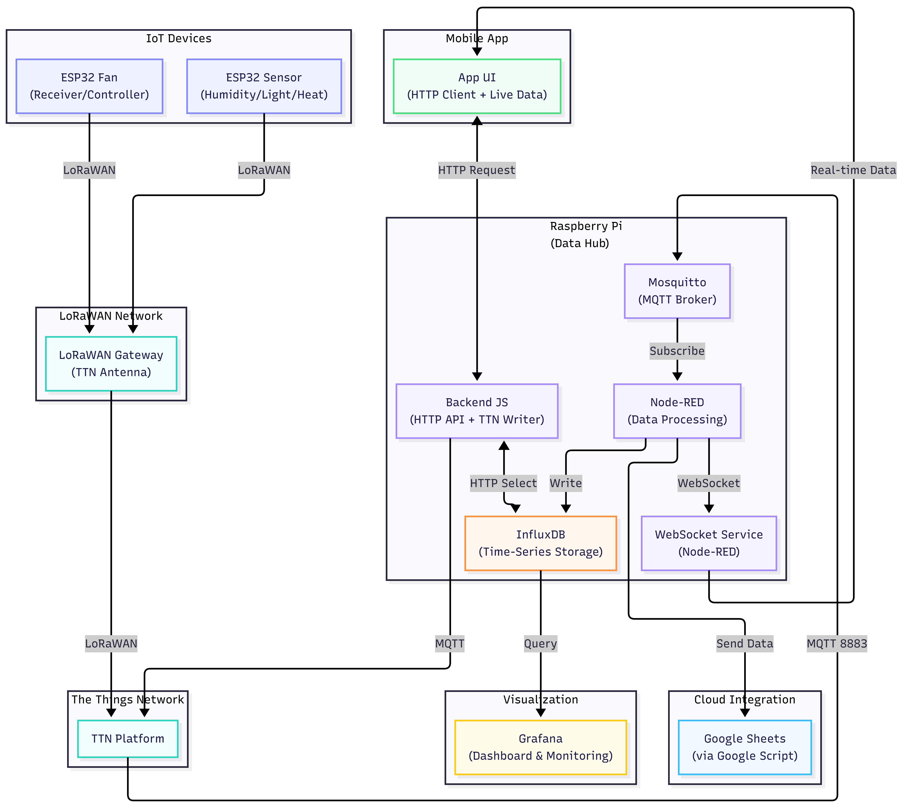

# ProjetFinalIoT

> Remarque : Ce projet est lié avec le repository suivant (application)[]

## Présentation du projet

- **Demande** : Création d'une chaîne IoT complète de l'acquisition, transformation et retransmission de données

- **Auteurs** : CHAFFAUX Kevin - FERRON Evan - BIGOT Lucas

- **Contexte de réalisation** : Module IOT, M1 Informatique DEV/IOT, Ynov Nantes

- **Description** : Dans un datacenter, il est nécessaire que la température reste sous un certain seuil afin d'éviter aux machines de surchauffer. Afin de palier à ce problème, nous avons réalisée deux blocs. Le premier dont le but est de recuillir des données est constitué de deux capteurs (DHT11 & LDR) afin de récupérer la luminosité, l'humidité et la température. Le second est utilisé pour gérer le bloc de ventilition auxilière. Il peut être mis en route par deux moyen :

1. Automatiquement : via une alerte configurable
2. Par action humaine : passage devant capteur ou via l'application.

- **Matériel requis** : -
  - 1 ventilateur
  - 2 esp32
  - 2 module RAK

## Présentation du répertoire GITHUB

Ce répertoire contient tous le nécessaire pour mettre en place de projet

1. Le dossier arduino contient les scripts pour les ESP32
2. Le dossier docker contient les fichiers dockers pour la mise en place du serveur
3. Le dossier docs contient les documentation sur l'architecture du projet & sur le RGPD
4. Le dossier grafana contient le dashboard exporté au format json ainsi que des screens du dashboard
5. Le dossier nodered contient la conf du flux de donnée exporté au format json et un screen du schéma
